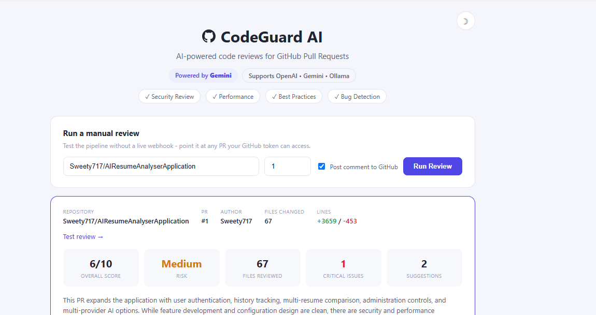
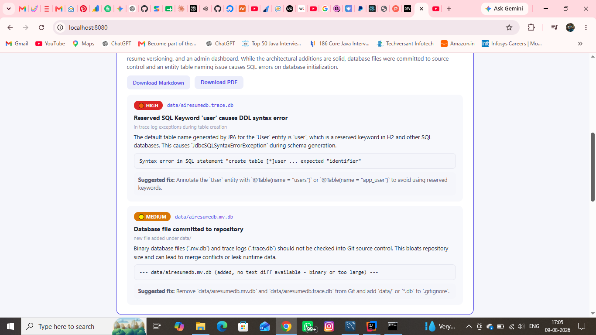
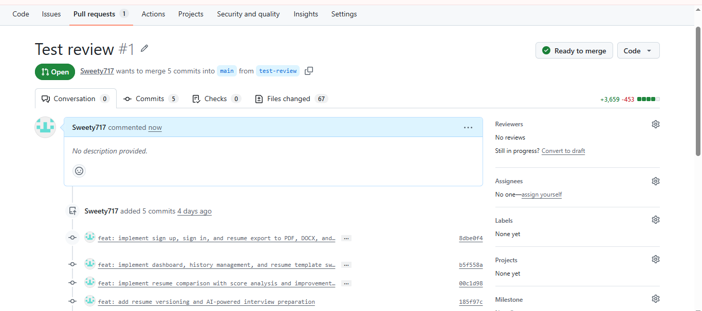
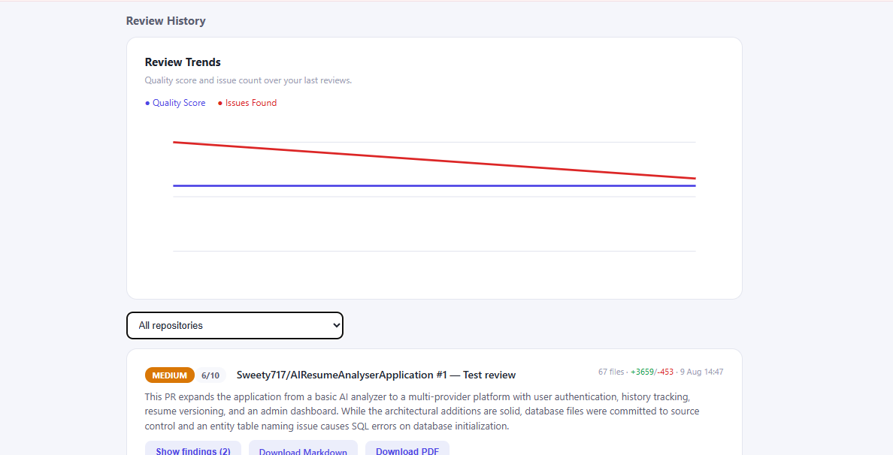

# CodeGuard AI

Self-hosted AI code review for GitHub pull requests. Spring Boot backend,
vanilla JS dashboard, your own OpenAI/Gemini/Ollama key. Every PR gets an
AI-generated review comment covering bugs, security issues, performance
problems, and best-practice violations - automatically, on every push.



## What's included

- GitHub webhook receiver — reviews every PR automatically on open/update
- AI review: risk level, findings by file with severity + category +
  suggested fix, plus a short "what's good" note
  
- Posts the review as a formatted comment directly on the PR
- Manual review endpoint/dashboard button — test the whole pipeline on any
  PR without needing a live webhook first

- Review history dashboard — every past review, searchable by nothing yet
  (small tool, small dashboard), expandable findings per review
  
- Multi-provider AI: OpenAI, Google Gemini, or a local Ollama instance —
  swap with one config line

## Requirements

- Java 17+, Maven 3.8+
- A GitHub Personal Access Token with PR read/write access
- An AI provider (OpenAI/Gemini API key, or a local Ollama install)

## Setup

### 1. Run it

```bash
mvn clean install
mvn spring-boot:run
```

### 2. Configure

In `application.properties`:

```properties
github.token=ghp_your_token_here
github.webhook-secret=any-random-string-you-pick

ai.provider=openai
openai.api.key=sk-your-key-here
```

Generate a token at **github.com/settings/tokens** — classic tokens need the
`repo` scope; fine-grained tokens need "Pull requests: Read and write" and
"Contents: Read-only" on the repos you want reviewed.

### 3. Test it without a webhook

Open `http://localhost:8080`, enter any `owner/repo` and PR number your
token can access, and click **Run Review**. This proves the whole pipeline
(GitHub fetch → AI review → comment posting) works before you wire up
automation.

### 4. Set up the live webhook

In your GitHub repo: **Settings → Webhooks → Add webhook**

| Field | Value |
|---|---|
| Payload URL | `https://your-domain.com/webhook/github` |
| Content type | `application/json` |
| Secret | same value as `github.webhook-secret` |
| Events | Just the `pull_request` event |

From then on, every PR opened, reopened, or pushed to gets reviewed
automatically within seconds.

## How it works

1. GitHub sends a webhook on PR open/update
2. Signature is verified (HMAC-SHA256) against your webhook secret
3. The PR's diff is fetched via the GitHub API
4. The diff goes to your configured AI provider with a structured review prompt
5. The AI's findings are posted back as a PR comment, and saved to local history

## Notes on this build

- Uses a single Personal Access Token, not a GitHub App — simplest setup
  for a self-hosted single-team tool. A GitHub App with per-installation
  tokens would be the natural upgrade for serving multiple orgs from one
  deployment.
- Large diffs are truncated per-file (configurable in `CodeReviewService.java`)
  to keep prompts within a reasonable token budget — extremely large PRs
  may get a partial review rather than failing outright.
- Posts one summary comment per PR, not inline line-by-line review comments.
  Inline comments require calculating diff "positions" (not line numbers) via
  GitHub's Review API — a solid v2 feature if you want to add it.

